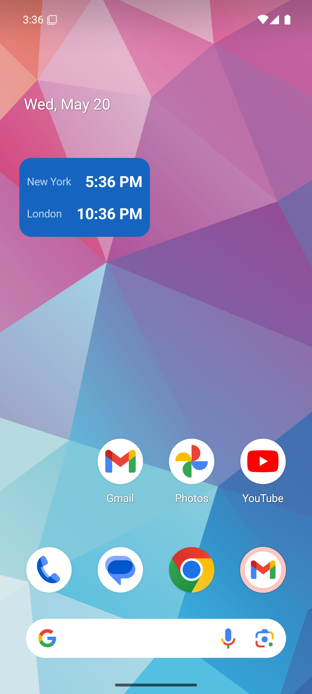
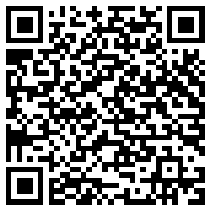

# Time Widget (Android)

A simple, configurable home-screen widget that shows the current time in the cities / time
zones you care about.



## Features

- **1–4 clocks**, each a city you pick from ~69,000 worldwide — search by name (e.g. "Queenstown").
- **Custom labels** — rename a clock to anything (e.g. show "Anna" instead of "Berlin").
- **12- or 24-hour**, set globally or per clock.
- **+1 / −1 day badge** when a zone is on a different calendar day than yours.
- **Appearance** — background color + opacity and text color/size, or just follow your phone's
  light/dark theme and Material You colors.
- **Tap the widget** any time to reconfigure it.

## Install on your phone

> Android only (8.0 / API 26 and up). This is a personal sideload build — it's **not** on the
> Play Store, so you install the APK directly.

**Easiest: scan this with your phone's camera**



…or, on the phone, open this link:

### ⬇️ [Download the latest APK](https://github.com/toddw080/android_global_clocks/releases/latest/download/android-global-clocks.apk)

Then:

1. Tap the downloaded **`android-global-clocks.apk`** (in your notifications, or your Downloads folder).
2. Android will say installs from this source are blocked → tap **Settings**, turn on
   **Allow from this source** (one-time), then tap **Back**.
3. If a **Play Protect** prompt appears, tap **Install anyway** (normal for apps outside the Play Store).
4. Tap **Install**, then **Done**.
5. **Add the widget:** long-press an empty area of your home screen → **Widgets** →
   **Time Widget** → drag it onto the screen. Pick your cities, format, and look.

## Updating

Re-download the APK from the link above and install it over the existing app — your placed
widgets and their settings are kept.

## Build it yourself

Open the project in **Android Studio** and run the `app` module, or from a terminal with a
device/emulator connected:

```
./gradlew installDebug
```
